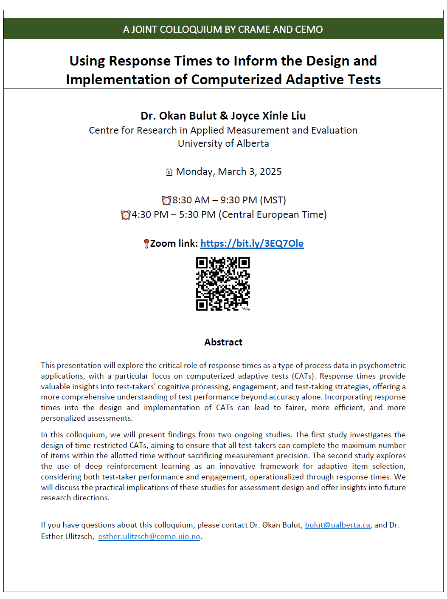

```{r setup, include=FALSE}
knitr::opts_chunk$set(echo = FALSE)
```

[Dr. Esther Ulitzsch](https://www.uv.uio.no/cemo/english/people/aca/estheru/) from [the Centre for Educational Measurement (CEMO)](https://www.uv.uio.no/english/?vrtx=unit-view&areacode=180700) at the University of Oslo and I have decided to organize a series of online colloquiums to share our research with each other and build a connection between the two centres ([CRAME](https://crame.ualberta.ca/) and CEMO). 

The first colloquium will be on **March 3, 2025** from **8:30 am to 9:30 am** (via Zoom). In this presentation, Joyce and I will present our ongoing research on the integration of response time with computerized adaptive testing (see the flyer below for further details). The Zoom link for our presentation is <https://bit.ly/3EQ7Ole>. We look forward to seeing you there!




[**RETURN TO THE NEWS PAGE**](https://okanbulut.github.io/news/)


