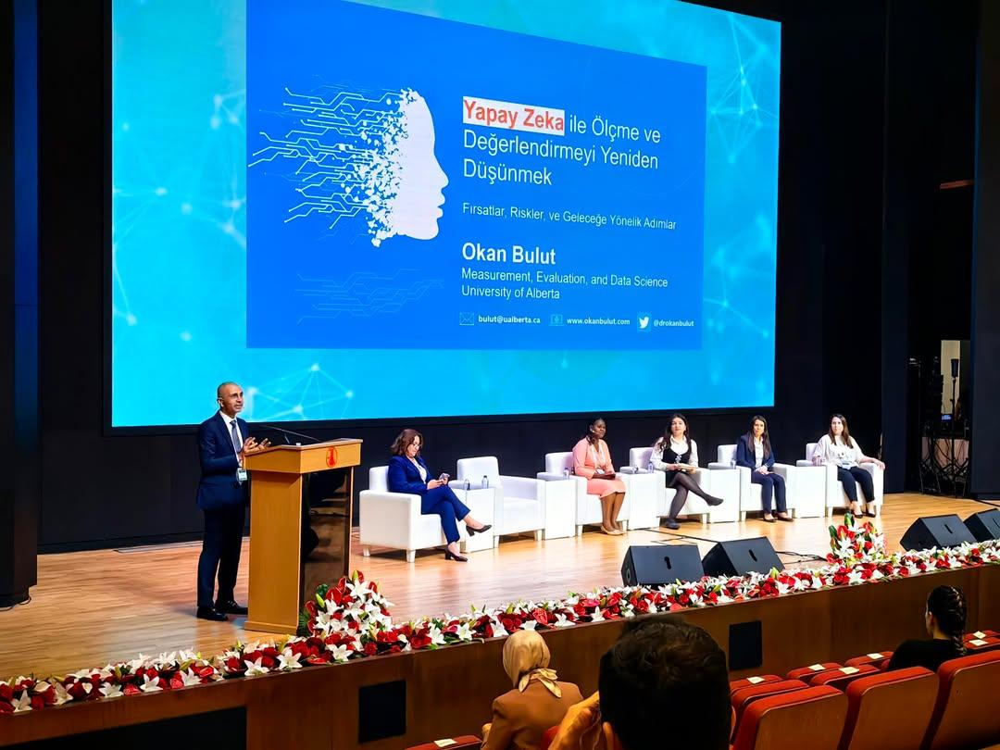

```{r setup, include=FALSE}
knitr::opts_chunk$set(echo = FALSE)
```

Between June 3 and 4, I had the pleasure of attending the **First International Education Congress** organized by the Turkish Ministry of Education in Ankara, Turkey. The event, (see [egitimkongre.meb.gov.tr](https://egitimkongre.meb.gov.tr/)), brought together educators, policymakers, and researchers from around the world to discuss the latest developments in education.

The main theme of the congress was the launch of the **Türkiye Yüzyılı Maarif Modeli**, a new curriculum framework designed to shape the future of education in Turkey. The congress served as a dynamic platform for sharing perspectives on how this model can transform classrooms and support student learning in the coming decades.

On June 3, I had the honor of being one of the panelists in a session dedicated to educational assessment. My talk, titled **"Rethinking Assessment through AI: Promises, Pitfalls, and Paths Forward,"** focused on the transformative potential—and the challenges—of integrating artificial intelligence (AI) into student evaluation.



During my talk, I shared my thoughts on how generative AI and other advanced technologies are reshaping the way we evaluate student learning. These tools can enhance efficiency and provide more personalized feedback, but they also come with significant risks. For instance, low AI literacy among teachers may hinder effective use, and an overreliance on AI could lead to a loss of critical thinking skills and undermine the authenticity of student work.

Beyond my presentation, I thoroughly enjoyed connecting with colleagues and exchanging ideas on how education is evolving in the age of artificial intelligence. It was inspiring to see so many passionate educators working to build a future where AI is harnessed responsibly to enhance learning outcomes.

I am grateful to the organizers for creating such a vibrant and thought-provoking event. As we move forward, I look forward to continuing these conversations and contributing to the ongoing development of innovative, ethical, and effective educational practices in the age of AI.


[**RETURN TO THE NEWS PAGE**](https://okanbulut.github.io/news/)
